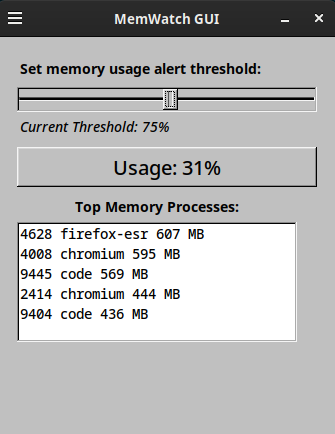

# memwatch

`memwatch` is a lightweight Linux C++ desktop app that monitors system memory usage and notifies you when usage crosses any threshold the user sets.

## Features

- Displays real-time memory usage and available memory
- User-defined memory usage alert threshold with on-screen and audible warnings
- Lists the top 5 memory-consuming processes using `/proc`
- Lightweight GUI using FLTK (Fast Light Toolkit)
- Simple installation and removal via `make install` / `make uninstall`

---

## Screenshot


## Dependencies

- Linux system with `/proc/meminfo`
- `g++`, `make`
- FLTK (1.3+)
- `espeak` (for voice alerts)

## Building

Clone and build the project:

```bash
git clone https://github.com/yourusername/memwatch-gui.git
cd memwatch-gui
make
